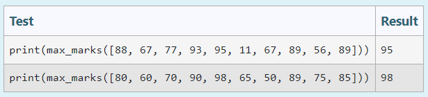

# Find the maximum of a list of numbers
## Aim:
To write a program to find the maximum of a list of numbers.
## Equipment’s required:
1.	Hardware – PCs
2.	Anaconda – Python 3.7 Installation / Moodle-Code Runner
## Algorithm:
1.	Get the list of marks as input
2.	Use the sort() function or max() function or use the for loop to find the maximum mark.
3.	Return the maximum value
## Program:

## i) Program to find the maximum of marks using the lst method sort.
### Sample Input:
 

```
Developed by: A.Ashwin Kumar
RegisterNumber: 22001702

def max_marks(marks):
    marks.sort()
    large=marks[-1]
    return large
```
### Output:


## ii)	Program To find the maximum marks using the list method max().
### Sample Input:

```
Developed by: A.ASHWIN KUMAR
RegisterNumber: 22001702

def max_marks(marks):
    large=max(marks)
    return large
```
### Output:

## iii) Program To find the maximum marks without using builtin functions.
### Sample Input:

```
Developed by: A.ASHWIN KUMAR
RegisterNumber: 22001702

def max_marks(list1):
    max = list1[0]
    for i in list1:
        if i > max:
            max=i
    return max
```
### Output:

## Result:
Thus the program to find the maximum of given numbers from the list is written and verified using python programming.